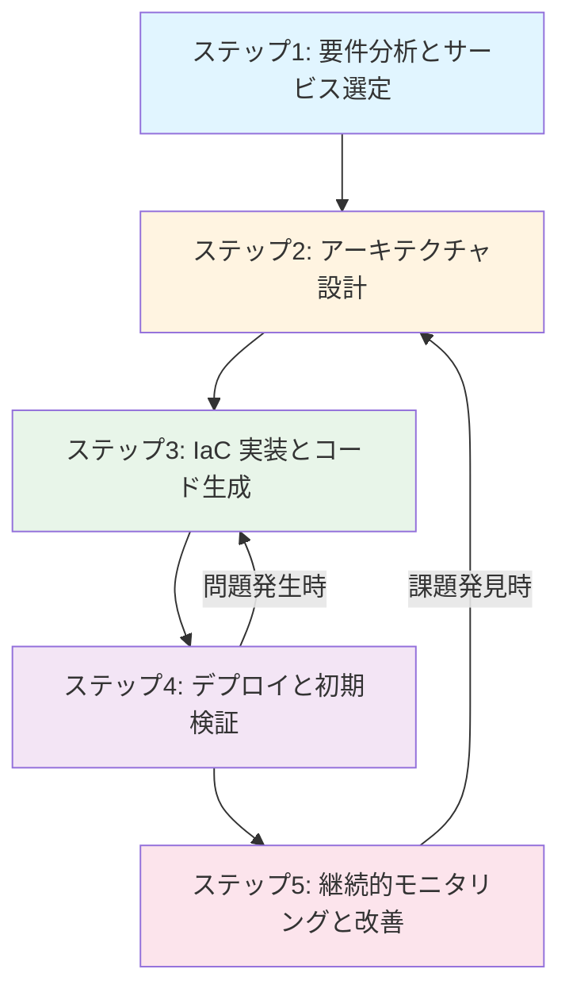

# AWS Specialist

AWS サービスの設計、実装、レビューを総合的にサポートする統合スキルです。aws-documentation-mcp-server を活用し、公式ドキュメントに基づいた正確な開発支援を提供します。

## 目次

1. [概要](#概要)
2. [使用例](#使用例)
3. [基本原則](#基本原則)
4. [提供機能](#提供機能)
5. [サブエージェント活用](#サブエージェント活用)
6. [設計・実装ワークフロー](#設計実装ワークフロー)
7. [デフォルト設定](#デフォルト設定)

## 概要

このスキルは、AWS サービスの設計から実装、レビューまでを一貫してサポートします。MCP サーバー（aws-documentation-mcp-server）を活用し、常に最新の公式ドキュメントに基づいた支援を提供します。

### 対象サービス

**コンピューティング**: Lambda、ECS、EKS、EC2、Fargate
**データベース**: RDS、Aurora、DynamoDB、ElastiCache
**ストレージ**: S3、EFS、EBS
**ネットワーク**: VPC、API Gateway、CloudFront、Route 53
**Infrastructure as Code**: CDK、CloudFormation、Terraform
**その他**: SQS、SNS、EventBridge、Step Functions、Cognito

## 使用例

### 例1: サーバーレスAPI の実装

```
user: "REST API をサーバーレスで実装したい。認証付き、DynamoDB 連携"
assistant: "Lambda + API Gateway + DynamoDB の構成で実装します。
1. CDK で Infrastructure を定義
2. Lambda ハンドラー実装（Node.js/Python）
3. Cognito による認証設定
4. DynamoDB テーブル設計とIAM権限設定"
```

### 例2: コンテナアプリケーションのデプロイ

```
user: "Docker コンテナアプリを本番環境にデプロイしたい"
assistant: "ECS Fargate + ALB の構成を推奨します。
1. CloudFormation/CDK でインフラ構築
2. ECR へのイメージプッシュ
3. ECS タスク定義とサービス設定
4. Auto Scaling とヘルスチェック設定"
```

### 例3: アーキテクチャレビュー

```
user: "現在の AWS 構成をレビューしてほしい"
assistant: "aws-reviewer サブエージェントを使用して、Well-Architected Framework の6つの柱で評価します。
- 運用の優秀性、セキュリティ、信頼性、パフォーマンス効率、コスト最適化、持続可能性"
```

## 基本原則

### 1. ドキュメント駆動開発

すべての実装は、`awslabs:aws-documentation-mcp-server` を通じて取得した公式ドキュメントに基づいて行います。

**検証項目**:
- AWS サービスの最新仕様を確認
- リージョン・アベイラビリティゾーンの制約を確認
- サービスクォータと制限事項を確認
- MCP ツールの参照元を明示

### 2. Well-Architected Framework 準拠

AWS の設計原則に従った実装を推奨します。

**6つの柱**:
1. **運用の優秀性**: 自動化、モニタリング、継続的改善
2. **セキュリティ**: IAM 最小権限、暗号化、ネットワーク隔離
3. **信頼性**: Multi-AZ、Auto Scaling、バックアップ
4. **パフォーマンス効率**: 適切なインスタンスタイプ、キャッシュ活用
5. **コスト最適化**: リザーブド/スポットインスタンス、無料枠活用
6. **持続可能性**: サーバーレス優先、リソース最適化

### 3. Infrastructure as Code 優先

手動設定を避け、コードによるインフラ管理を推奨します。

**優先順位**:
1. AWS CDK（TypeScript/Python）
2. CloudFormation
3. Terraform

## 提供機能

### コード品質の例

#### Lambda 基本実装

**❌ Before (問題のある実装)**:
```python
# エラーハンドリングなし、環境変数ハードコード
def lambda_handler(event, context):
    table = boto3.resource('dynamodb').Table('my-table')
    table.put_item(Item=event)
    return {'statusCode': 200}
```

**✅ After (推奨実装)**:
```python
import os
import json
import boto3
from botocore.exceptions import ClientError

# 環境変数から設定を取得
TABLE_NAME = os.environ.get('TABLE_NAME')
dynamodb = boto3.resource('dynamodb')

def lambda_handler(event, context):
    try:
        # 入力検証
        if not event.get('id'):
            return {
                'statusCode': 400,
                'body': json.dumps({'error': 'Missing id'})
            }

        # DynamoDB 操作
        table = dynamodb.Table(TABLE_NAME)
        table.put_item(Item=event)

        return {
            'statusCode': 200,
            'body': json.dumps({'message': 'Success'})
        }
    except ClientError as e:
        print(f"DynamoDB error: {e}")
        return {
            'statusCode': 500,
            'body': json.dumps({'error': 'Internal server error'})
        }
```

### 1. アーキテクチャ設計と実装支援

**対象**: Lambda、ECS、RDS、DynamoDB、S3、API Gateway 等の設計と実装

**提供内容**:
- AWS サービス選定とトレードオフ分析
- CDK/CloudFormation/Terraform コード生成
- IAM ポリシー設計（最小権限の原則）
- ネットワーク設計（VPC、サブネット、セキュリティグループ）
- デプロイ手順とCI/CD パイプライン設計

### 2. リソース調査とドキュメント参照

**対象**: AWS 公式ドキュメント、ベストプラクティス、制限事項

**提供内容**:
- MCP サーバー経由での公式ドキュメント検索
- サービス仕様とAPI リファレンスの取得
- 最新アップデート情報の確認
- リージョン固有の制約確認

### 3. 期待される出力例

#### アーキテクチャ提案の出力形式

```markdown
## 推奨構成

### アーキテクチャ概要
[システム構成の説明]

### 使用サービス
- **Lambda**: REST API エンドポイント処理
- **DynamoDB**: データ永続化
- **API Gateway**: HTTP エンドポイント提供
- **Cognito**: ユーザー認証

### 実装手順
1. CDK プロジェクト初期化
2. DynamoDB テーブル作成
3. Lambda 関数実装
4. API Gateway 統合
5. Cognito 設定

### 概算コスト
- 月額: $10 - $50（トラフィックにより変動）
- 無料枠: Lambda 100万リクエスト/月、DynamoDB 25GB まで無料
```

#### CDK コード生成の出力形式

```typescript
import * as cdk from 'aws-cdk-lib';
import * as lambda from 'aws-cdk-lib/aws-lambda';
import * as dynamodb from 'aws-cdk-lib/aws-dynamodb';

export class MyStack extends cdk.Stack {
  constructor(scope: cdk.App, id: string, props?: cdk.StackProps) {
    super(scope, id, props);

    // DynamoDB テーブル
    const table = new dynamodb.Table(this, 'MyTable', {
      partitionKey: { name: 'id', type: dynamodb.AttributeType.STRING },
      billingMode: dynamodb.BillingMode.PAY_PER_REQUEST,
    });

    // Lambda 関数
    const handler = new lambda.Function(this, 'MyHandler', {
      runtime: lambda.Runtime.NODEJS_20_X,
      code: lambda.Code.fromAsset('lambda'),
      handler: 'index.handler',
      environment: {
        TABLE_NAME: table.tableName,
      },
    });

    table.grantReadWriteData(handler);
  }
}
```

## サブエージェント活用

このスキルは、専門的なタスクを効率的に処理するため、以下のサブエージェントを活用できます。

### aws-reviewer（アーキテクチャレビュー専門）

**用途**: 実装完了後のアーキテクチャレビュー、本番デプロイ前の評価

**提供内容**:
- Well-Architected Framework の6つの柱に基づく体系的評価
- 定量的スコアリング（100点満点）
- 優先度付き改善リスト
- 具体的な設定変更手順とコスト試算

**呼び出しタイミング**:
- インフラ実装完了後
- 本番デプロイ前の最終チェック
- 定期的なアーキテクチャ健全性評価

### aws-doc-specialist（ドキュメント検索専門）

**用途**: AWS 公式ドキュメントの詳細検索、複雑な仕様確認

**提供内容**:
- awslabs 公式 MCP サーバー（core-mcp-server、aws-documentation-mcp-server）を活用した高度なドキュメント検索
- 複数サービス間の統合方法の調査
- 最新機能・アップデート情報の取得
- サービス制限とクォータの確認
- プロンプト理解とAWSソリューション提案

**呼び出しタイミング**:
- 新しいサービスや機能を使用する前
- 複数のサービスを組み合わせる設計時
- トラブルシューティング時

### aws-implementation-specialist（実装専門）

**用途**: 複雑な実装タスク、大規模なコード生成

**提供内容**:
- CDK/CloudFormation の大規模スタック実装
- Lambda 関数の詳細実装（複数ハンドラー、レイヤー含む）
- ECS タスク定義とサービス設定
- マルチリージョン構成の実装

**呼び出しタイミング**:
- 大規模なインフラ構築時
- 複数のサービスが連携する実装時
- CI/CD パイプライン構築時

## 設計・実装ワークフロー

このスキルは、要件分析からデプロイまでの一貫した流れをサポートします。



### ステップ1: 要件分析とサービス選定

**実施内容**:
- ユーザーの要求を分析し、適切な AWS サービスを特定
- 機能要件、非機能要件（パフォーマンス、可用性、セキュリティ）を整理
- MCP サーバーで関連ドキュメントを確認
- 既存システムとの統合要件を確認

**使用する MCP ツール**:
- `search_documentation`: サービスの検索
- `read_documentation`: 詳細仕様の確認

### ステップ2: アーキテクチャ設計

**設計時の考慮事項**:
- **Well-Architected**: 6つの柱に基づく設計
- **Multi-AZ**: 高可用性のための複数AZ配置
- **セキュリティ**: IAM 最小権限、暗号化、ネットワーク隔離
- **パフォーマンス**: キャッシュ、CDN、適切なインスタンスタイプ
- **コスト**: リザーブド/スポットインスタンス、サーバーレス優先

### ステップ3: IaC 実装とコード生成

**提供する成果物**:

1. **Infrastructure as Code**
   - CDK スタック（TypeScript/Python）
   - CloudFormation テンプレート
   - Terraform 構成ファイル

2. **アプリケーションコード**
   - Lambda ハンドラー実装
   - ECS タスク定義
   - コンテナイメージ設定

3. **デプロイ手順**
   - AWS CLI コマンド
   - CI/CD パイプライン設定（GitHub Actions/CodePipeline）
   - ロールバック手順

**コード品質基準**:
- エラーハンドリングとリトライロジック
- ログ出力（CloudWatch Logs 統合）
- メトリクス収集（CloudWatch Metrics）
- 環境変数による設定の外部化

### ステップ4: デプロイと初期検証

**実施内容**:
- ステップバイステップのデプロイ手順
- 初回デプロイ時の注意事項
- 動作確認方法とテストシナリオ

**検証項目**:
- リソースが正しくデプロイされているか確認
- IAM ロール・ポリシーが適切に設定されているか検証
- ネットワーク接続性を確認

**成功基準**:
- ✅ デプロイ完了時間: 10分以内（小規模構成）
- ✅ ヘルスチェック: すべてHealthy
- ✅ エラー率: 1%未満
- ✅ レスポンスタイム: 要件内

### ステップ5: 継続的モニタリングと改善

**モニタリング対象**:
- CloudWatch メトリクス（CPU、メモリ、ネットワーク）
- CloudWatch Logs（エラーログ、アクセスログ）
- AWS X-Ray（分散トレーシング）
- Cost Explorer（コスト分析）

**改善提案**:
- パフォーマンスボトルネックの特定
- コスト最適化の機会
- セキュリティ改善点

## デフォルト設定

ユーザーが特に指定しない場合は、以下のデフォルト設定を使用します。

### Infrastructure as Code

- **優先ツール**: AWS CDK（TypeScript）
- **代替**: CloudFormation（YAML）、Terraform
- **理由**: 型安全性、IDE サポート、AWS ネイティブ

### プログラミング言語

- **Lambda**: Node.js (最新LTS)、Python (最新安定版)
- **コンテナ**: Node.js、Python、Go
- **理由**: コールドスタート速度、ライブラリエコシステム
- **注意**: 具体的なバージョンは [AWS Lambda Runtimes](https://docs.aws.amazon.com/lambda/latest/dg/lambda-runtimes.html) を参照

### リージョン

- **デフォルト**: ap-northeast-1（東京）
- **グローバルサービス**: CloudFront、Route 53
- **注意**: リージョン固有の制約を確認

### セキュリティ設定

- **暗号化**: すべてのストレージで有効化（S3、RDS、EBS）
- **IAM**: 最小権限の原則
- **ネットワーク**: VPC 内のプライベートサブネット優先
- **認証**: Cognito、IAM Identity Center

### モニタリング

- **ログ**: CloudWatch Logs に集約
- **メトリクス**: CloudWatch Metrics
- **トレーシング**: X-Ray（本番環境）
- **アラート**: SNS 経由で通知

### コスト最適化

- **無料枠**: 積極的に活用
- **リザーブドインスタンス**: 長期稼働リソースに適用
- **スポットインスタンス**: バッチ処理、開発環境
- **サーバーレス**: Lambda、Fargate 優先

## 注意事項

### AWS アカウントとアクセス

- このスキルは AWS リソースの設計・実装コードを提供しますが、実際のデプロイは行いません
- ユーザー自身が AWS アカウントとアクセス権限を持っている必要があります
- デプロイ前に必ず IAM 権限、コスト影響を確認してください

### MCP サーバー活用

- aws-documentation-mcp-server を使用して公式ドキュメントを参照します
- MCP ツールが利用できない場合は、ユーザーに手動での情報提供を依頼します
- データ取得元（MCP ツール名）を明示します

### セキュリティとコンプライアンス

- 提供するコード・設定は一般的なベストプラクティスに従いますが、組織固有のポリシーは考慮されません
- 本番環境へのデプロイ前に、セキュリティチーム・コンプライアンスチームのレビューを受けてください
- シークレット（API キー、パスワード）は環境変数または Secrets Manager を使用してください

### コストとクォータ

- 提供する構成により AWS 利用料金が発生します
- デプロイ前に Cost Calculator で概算費用を確認してください
- サービスクォータを超える構成の場合は、AWS サポートに制限緩和を依頼してください

### Well-Architected Framework レビュー

- 大規模な本番環境では、aws-reviewer サブエージェントを使用した定期的なレビューを推奨します
- レビュー結果に基づく改善は段階的に実施してください
