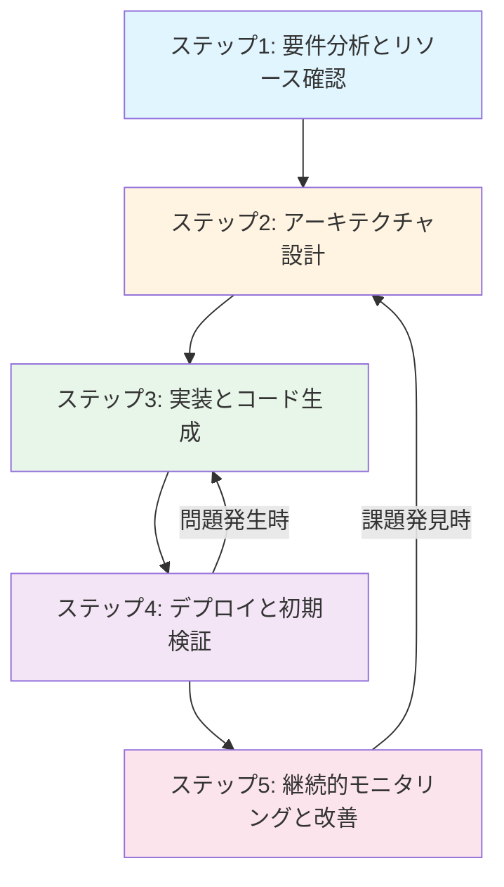

## Cloudflare 設計・実装支援スキル

このスキルは、Cloudflare の全サービスについて、**アーキテクチャ設計**と**実装支援**を専門的に提供します。MCP サーバーと公式ドキュメントに基づいた正確なサポートを行い、レビューが必要な場合は専門のサブエージェント（cloudflare-reviewer）を活用します。

## 目次

1. [使用例](#使用例)
2. [主要機能](#主要機能)
3. [サブエージェント活用](#サブエージェント活用)
4. [基本原則](#基本原則)
5. [設計・実装ワークフロー](#設計・実装ワークフロー)
6. [サービスカタログと実装パターン](#サービスカタログと実装パターン)
7. [MCP ツール活用](#mcp-ツール活用)
8. [デフォルト設定](#デフォルト設定)
9. [依存関係](#依存関係)
10. [注意事項](#注意事項)

---

## 使用例

### 例1: Workers API の実装

```
状況: REST API を Workers で実装したい
要求: TypeScript、D1 連携、認証機能、エラーハンドリング
期待: 実装コード、wrangler.toml 設定、デプロイ手順
```

### 例2: Pages アプリケーションのアーキテクチャ設計

```
状況: Next.js アプリケーションを Pages にデプロイする最適な構成を設計
要求: SSR/SSG 戦略、R2 統合、環境変数管理
期待: アーキテクチャ図、実装ガイド、ベストプラクティス
```

### 例3: 既存インフラのリソース調査

```
状況: 現在のゾーン設定と DNS レコードを確認したい
要求: MCP でリソース取得、設定の妥当性検証
期待: 現状レポート、ベストプラクティスとの比較、改善提案
```

### 例4: 実装後のレビュー（サブエージェント活用）

```
状況: 実装完了後、本番デプロイ前にインフラレビューが必要
要求: パフォーマンス、セキュリティ、コスト効率の評価
期待: cloudflare-reviewer サブエージェントによる体系的レビュー
```

## 主要機能

このスキルは、Cloudflare の設計と実装に特化した2つの主要機能を提供します。

### コード品質の例

#### Workers 基本実装

**❌ Before (問題のある実装)**:
```typescript
// エラーハンドリングなし、環境変数ハードコード
export default {
  async fetch(request) {
    const response = await fetch('https://api.example.com/data');
    return new Response(response.body);
  }
}
```

**✅ After (推奨実装)**:
```typescript
// エラーハンドリング、環境変数、型安全性
export default {
  async fetch(request: Request, env: Env): Promise<Response> {
    try {
      const response = await fetch(env.API_ENDPOINT);
      if (!response.ok) {
        throw new Error(`API error: ${response.status}`);
      }
      return new Response(await response.text());
    } catch (error) {
      console.error('Fetch error:', error);
      return new Response('Internal Server Error', { status: 500 });
    }
  }
}
```

### 1. アーキテクチャ設計と実装支援

**対象**: Workers、Pages、R2、D1、KV、Durable Objects 等の設計と実装

**提供内容**:
- エッジファーストアーキテクチャの設計
- サービス選定とトレードオフ分析
- TypeScript/JavaScript コード生成
- wrangler.toml 設定、デプロイ手順
- エラーハンドリングとテスト実装
- CI/CD パイプライン設計

**詳細**: `./SERVICE_CATALOG.md` と `./EXAMPLES.md` を参照

### 2. リソース調査と設定確認

**対象**: ゾーン設定、DNS レコード、Workers 設定、Analytics データ

**提供内容**:
- MCP サーバー経由でのリアルタイムデータ取得
- 設定の妥当性検証とベストプラクティス比較
- Analytics データ分析と傾向把握
- 問題点の検出と基本的な改善提案

**詳細**: `./MCP_TOOLS.md` を参照

## サブエージェント活用

このスキルは、専門的なタスクを効率的に処理するため、以下のサブエージェントを活用できます。

### cloudflare-reviewer（インフラレビュー専門）

**用途**: 実装完了後のインフラレビュー、本番デプロイ前の評価

**提供内容**:
- Cloudflare 6つの柱に基づく体系的評価
- 定量的スコアリング（100点満点）
- 優先度付き改善リスト
- 具体的な設定変更手順と ROI 試算

**呼び出しタイミング**:
- 実装完了後、本番デプロイ前
- 定期的なインフラ監査が必要な時
- パフォーマンス問題やセキュリティ懸念がある時
- コスト最適化の評価が必要な時

**詳細**: `./REVIEW_PILLARS.md` と `./CHECKLIST.md` を参照

### 使用方法

レビューが必要な場合、このスキル内から cloudflare-reviewer サブエージェントを呼び出して専門的な評価を依頼できます。設計・実装とレビューを分離することで、各フェーズに最適化された支援を提供します。

## 基本原則

### 1. MCP サーバー駆動

すべての調査・実装・レビューは、`cloudflare:mcp-server-cloudflare` を通じて取得したリソース情報とベストプラクティスに基づいて実行します。

**必須アクション**:
- サービスの制限事項、API、設定について MCP サーバーで確認
- 現在のゾーン設定やリソース状態を取得してから設計
- MCP ツールの参照元を明示

### 2. エッジファーストアーキテクチャ

**設計原則**:
- エッジでの処理を最大化し、オリジンへのリクエストを最小化
- グローバル分散を考慮したステートレス設計
- キャッシュ戦略をアーキテクチャの中心に配置

### 3. データに基づく意思決定

**検証項目**:
- API レスポンスの構造を確認
- 設定値の妥当性を検証
- 推測や記憶に頼らず、常に最新データを取得

## 設計・実装ワークフロー

このスキルは、要件分析からデプロイまでの一連の流れをサポートします。



### ステップ1: 要件分析とリソース確認

**実施内容**:
- ユーザーの要求を分析し、適切な Cloudflare サービスを特定
- MCP サーバーで現在のゾーン設定、DNS レコード、Workers Routes を確認
- 既存のリソースとの競合や依存関係を特定

**使用する MCP ツール**:
- ゾーン設定取得
- DNS レコード確認
- Workers 設定確認

### ステップ2: アーキテクチャ設計

**設計時の考慮事項**:
- **エッジファースト**: エッジでの処理最大化
- **グローバル分散**: マルチリージョン配置、レイテンシ最適化
- **セキュリティ**: WAF、DDoS 保護、Zero Trust
- **パフォーマンス**: キャッシュヒット率 90%以上、TTFB 100ms未満
- **コスト**: 無料枠活用、R2 Egress 無料化の活用

### ステップ3: 実装とコード生成

**提供する成果物**:

1. **Workers/Pages コード**
   - TypeScript/JavaScript 実装
   - wrangler.toml/wrangler.jsonc 設定
   - 環境変数とシークレット管理

2. **ストレージ統合**
   - R2 バケット設定
   - D1 データベーススキーマ
   - KV 名前空間設定

3. **デプロイ手順**
   - wrangler コマンド
   - CI/CD パイプライン設定（GitHub Actions 等）
   - ロールバック手順

**コード品質基準**:
- エラーハンドリングとリトライロジックの実装
- ログ出力（Workers Logs/Logpush 統合）
- パフォーマンスモニタリング（Analytics Engine）
- 環境変数による設定の外部化

### ステップ4: デプロイと初期検証

**実施内容**:
- ステップバイステップのデプロイ手順
- 初回デプロイ時の注意事項
- 動作確認方法とテストシナリオ

**検証項目**:
- Workers/Pages が正しくデプロイされているか確認
- DNS レコード、ルーティングが適切か検証
- 基本的なパフォーマンス、レスポンスタイムを測定

**成功基準**:
- ✅ デプロイ完了時間: 30秒以内
- ✅ 初回リクエスト TTFB: 200ms未満
- ✅ エラー率: 1%未満
- ✅ DNS 伝播: 5分以内に確認可能

### ステップ5: 継続的モニタリングと改善

**設定すべき監視項目**:
- Workers Analytics（リクエスト数、エラー率、CPU 時間）
- Web Analytics（トラフィック、パフォーマンス）
- Logpush（構造化ログの外部送信）
- Health Checks（エンドポイント監視）

**改善サイクル**:
1. MCP サーバーで Analytics データ取得
2. パフォーマンス指標の分析
3. ボトルネックの特定
4. 改善策の実装
5. 効果測定

## サービスカタログと実装パターン

Cloudflare の全サービス分野をカバーします。詳細な実装ガイドと具体例は以下を参照してください：

- **サービスカタログ**: `./SERVICE_CATALOG.md`
  - エッジコンピューティング（Workers、Pages、Durable Objects）
  - ストレージ（R2、KV、D1、Queues）
  - ネットワーキング（Load Balancing、Argo、Spectrum）
  - セキュリティ（WAF、DDoS、Zero Trust、Access）
  - パフォーマンス（CDN、Image Optimization、Stream）

- **実装例**: `./EXAMPLES.md`
  - REST API（Workers + D1）
  - 画像最適化サービス（Workers + R2）
  - リアルタイムチャット（Durable Objects + WebSocket）
  - 静的サイト + API（Pages + Workers Functions）

## MCP ツール活用

Cloudflare MCP サーバーの利用可能なツールと使用方法は `./MCP_TOOLS.md` を参照してください。

### 主要な MCP ツール

1. **ゾーン設定取得**: SSL/TLS、キャッシュ、セキュリティ設定
2. **DNS レコード取得**: A/AAAA/CNAME/MX レコード一覧
3. **Workers 設定確認**: Routes、環境変数、バインディング
4. **Analytics データ取得**: トラフィック、パフォーマンス、エラー率
5. **ファイアウォールルール確認**: WAF、Rate Limiting、Bot Management

**データ参照の明示**:
```
📊 **データ取得元**: cloudflare:mcp-server-cloudflare
🔧 **使用ツール**: ゾーン設定取得
📅 **取得日時**: [タイムスタンプ]
```

## インフラレビューが必要な場合

実装完了後、本番デプロイ前にインフラレビューが必要な場合は、**cloudflare-reviewer サブエージェント**を活用してください。

### cloudflare-reviewer の機能

Cloudflare の思想（エッジファースト、Zero Trust、開発者体験重視）に基づいた6つの柱で体系的に評価します：

1. **エッジファースト・アーキテクチャ**: キャッシュヒット率、オリジンリクエスト削減
2. **Zero Trust セキュリティ**: WAF、DDoS、Cloudflare Access
3. **開発者体験**: デプロイ時間、CI/CD、モニタリング
4. **エンドユーザーパフォーマンス**: TTFB、Core Web Vitals
5. **コスト効率**: 無料枠活用、R2 Egress 最適化
6. **信頼性とレジリエンス**: Load Balancing、Always Online

**レビュー結果**:
- 各柱の評価スコア（100点満点）
- 優先度付きの改善リスト
- 具体的な設定変更手順と ROI 試算

詳細な評価基準とチェックリストは以下を参照：
- `./REVIEW_PILLARS.md` - 各柱の評価観点と Cloudflare 特有の指標
- `./CHECKLIST.md` - 120項目以上の体系的チェックポイント

## デフォルト設定

ユーザーから特別な指示がない限り、以下のデフォルト設定で作業を進めます：

### 開発環境

| 項目 | デフォルト値 | 理由 |
|------|-------------|------|
| ランタイム | Workers（Service Worker 形式） | 標準的な Workers 形式 |
| 言語 | TypeScript | 型安全性、開発体験 |
| ツール | wrangler CLI | 公式ツール、機能豊富 |

### セキュリティ

| 項目 | デフォルト値 | 理由 |
|------|-------------|------|
| HTTPS | 強制 | セキュリティベストプラクティス |
| WAF | 有効（マネージドルール） | 基本的な保護 |
| TLS バージョン | TLS 1.3 | セキュリティ推奨 |

### パフォーマンス

| 項目 | デフォルト値 | 理由 |
|------|-------------|------|
| キャッシュ | 積極的（CDN + Workers Cache API） | レイテンシ削減 |
| 圧縮 | Brotli/Gzip 有効 | 帯域幅削減 |
| TTFB 目標 | 100ms未満 | パフォーマンス目標 |

### リソース調査

| 項目 | デフォルト値 | 説明 |
|------|-------------|------|
| データ範囲 | 全ゾーン | 特定ゾーンに絞る場合は指定 |
| Analytics 期間 | 過去7日間 | カスタム期間指定可能 |
| 詳細レベル | サマリー | 詳細データが必要な場合は指定 |

### レビュー範囲

| 項目 | デフォルト値 | 説明 |
|------|-------------|------|
| 評価柱 | 全6柱 | 特定の柱に絞る場合は指定 |
| 詳細レベル | サマリー | 詳細分析が必要な場合は明示的に指定 |
| 優先度フィルター | Critical/High | Medium/Low は要望に応じて含める |

## 依存関係

このスキルが正常に動作するために必要な依存関係：

### 必須依存関係

- **cloudflare-mcp-server** (`cloudflare:mcp-server-cloudflare`)
  - Cloudflare リソースの取得と操作に使用
  - 使用するツール:
    - ゾーン設定取得
    - DNS レコード確認
    - Workers 設定確認
    - Analytics データ取得
    - ファイアウォールルール確認

### オプション依存関係

- **wrangler CLI**: Workers/Pages のデプロイと管理に必要
- **Node.js/npm**: ローカル開発とビルドに使用
- **Miniflare**: ローカルテスト環境
- **Lighthouse CLI**: パフォーマンス測定に使用

### 関連エージェント

- **cloudflare-specialist**: このスキルのメインエージェント（包括的なCloudflareサポート）
- **cloudflare-rag-specialist**: cloudflare-rag MCPサーバー専門のスペシャリストエージェント（公式ドキュメント検索）

## 注意事項

1. **サービス制限**: Workers CPU 時間（10ms/50ms）、メモリ（128MB）等の制限を考慮
2. **料金**: 無料枠（Workers: 100,000 req/day）と有料プランの違いを明示
3. **セキュリティ**: シークレット管理、CORS 設定、CSP ヘッダーの適用
4. **MCP サーバー**: すべての調査・レビューは MCP サーバー経由で実行
5. **本番環境**: 変更は必ずステージング環境で検証してから適用
6. **API レート制限**: Cloudflare API のレート制限を考慮
7. **リアルタイムデータ**: 常に最新データを取得（キャッシュ非推奨）
8. **データ機密性**: 取得したデータには機密情報が含まれる可能性

## エラーハンドリング

### MCP サーバーが利用できない場合

**対応方法**:
1. エラーメッセージをユーザーに伝達
2. 代替手段（Dashboard、API 直接呼び出し）を提案
3. 一般的な知識での回答は避ける（データに基づかないため）

### 実装エラー

- **Workers CPU 時間超過**: 処理の最適化または Durable Objects への移行を提案
- **メモリ制限**: データ処理の分割またはストリーミングを提案
- **DNS 設定エラー**: DNS レコードの確認と修正手順を提示

### デプロイエラー

- **wrangler のビルド失敗**: エラーメッセージ分析と依存関係確認
- **Pages ビルドエラー**: ビルドログの分析とビルド設定の見直し

---

このスキルにより、Cloudflare サービスの実装、リソース調査、インフラレビューを統合的に実現し、正確で高性能、かつスケーラブルなエッジコンピューティング環境を構築できます。
