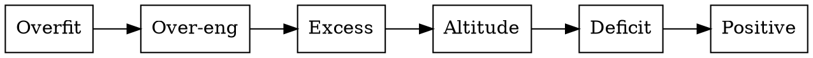

# Dreaming — ルール文書の棚卸し

CLAUDE.md とプロジェクトドキュメントの**過不足・overfit・altitude（原則と機構詳細の混在）**を検出し、`.docs/reviews/` にレポートを残す。**修正はしない — 分析と推奨アクションの報告のみ。**

---

## Step 1: 対象ファイルを収集する

以下を順に探索し、**存在するものだけ**を対象リストに加える。1ファイルの読み取り失敗で全体を止めない（fail-open）。

| 優先度 | ファイル | 探索方法 |
|---|---|---|
| 1 | `~/.claude/CLAUDE.md` | 直接読む |
| 2 | プロジェクトの `CLAUDE.md` | cwd から読む |
| 3 | `AGENTS.md` | cwd から読む |
| 4 | standards 系ドキュメント | cwd から `AI_FIRST.md`, `ARCHITECTURE.md`, `DESIGN.md`, `DOCS_OPS.md`, `PROJECT_RULES.md`, `PRODUCT_PLAYBOOK.md`, `AUDIT.md` を探す |
| 5 | `~/.claude/references/` 配下 | glob で `.md` を列挙 |

各ファイルの**行数を計測**し、Step 3 で使う。

## Step 2: 6レンズで分析する

各ファイルを順に読み、以下の6レンズで指摘を収集する。**横断分析（ファイル間の重複・正本関係）は全ファイル読了後に行う。**



### Overfit — 1回の経験の一般化

4 問フィルタ③（正本: `~/.claude/references/self-improvement.md`）を適用: 特定の日付・プロジェクト名・インシデントへの直接参照がルール文に焼き込まれていないか。

- 原則は正しいが根拠の注釈が固有名詞に依存 → brain note にポインタ化を推奨
- 版固有の情報（ライブラリの beta 状態、API の廃止状況）が standards に固定されている → 調査ドキュメントに委譲を推奨

### Over-engineering — YAGNI 違反

まだ必要になっていない領域の先取り設計を検出する。

- **判定基準**: そのルールが適用されたプロジェクトが**1つも存在しない**のに MUST/SHOULD で規定されている
- 「予防的に先取りしない」と書きつつ先取りしている矛盾を特に探す

### Excess — 重複・正本の曖昧化

同じルールが2箇所以上に**実体として**存在する（ポインタでなく）ケースを検出する。

- 「正本は X」と書いてあるのに、別の場所に同じフレーズが実体として存在
- 1つの概念の定義が複数ファイルに分散し、どれが正本か不明

### Altitude — 機構詳細が原則文書に混入

4 問フィルタ①（同上）を適用: コードブロック・コマンド手順・設定値・ツール固有の挙動が、原則レベルの文書（CLAUDE.md, ARCHITECTURE.md 等）にインラインで存在。

- 実装レシピ → `templates/recipes/` に移動を推奨
- ツール固有の手順 → skill や brain note に移動を推奨
- 設定値の詳細 → `references/` に移動を推奨

### Deficit — 不足

MUST で参照されるが定義がない概念・基準、または暗黙に依存しているが明文化されていないルールを検出する。

### Positive — 良い設計パターン

正本の一元化、self-test の組み込み、棚卸し基準の明文化、anti-gaming など、維持すべき良いパターンを記録する。削るべきでないものを明示する。

## Step 3: CLAUDE.md 固有の計測

Global CLAUDE.md に対して追加の計測を行う:

- **行数 vs 閾値**: 現在の行数と 150 行閾値の差分を報告
- **行動シグナル診断**（このセッションで観測できた場合のみ）:
  - ルールがあるのに従わなかった → 長すぎのサイン（剪定候補）
  - 記載事項をユーザーに質問した → 表現が曖昧（言い換え候補）
- **剪定基準の適用**: 各指摘に「この行を消すとミスが起きるか？」を問い、No なら削除候補としてマーク

## Step 4: レポートを生成する

`.docs/reviews/YYYY-MM-DD-dreaming.md` に以下の形式で出力する。`.docs/reviews/` が存在しない場合は作成する。

```markdown
---
type: dreaming
date: YYYY-MM-DD
target:
  - ~/.claude/CLAUDE.md (N lines)
  - AGENTS.md (N lines)
  - ...
---

# Dreaming Report — YYYY-MM-DD

## Volume

| File | Lines | Note |
|---|---|---|
| ~/.claude/CLAUDE.md | N | 閾値まで M 行 |
| ... | | |

## Findings

### Overfit (N件)

- **[タイトル]** — `file` — 説明。推奨: ...

### Over-engineering (N件)
...

### Excess (N件)
...

### Altitude (N件)
...

### Deficit (N件)
...

### Positive (N件)
...

## Recommended Actions (優先度順)

1. **[アクション]** — 効果: ...
2. ...
```

## Step 5: サマリーを報告する

チャットにレポートの要約を出力する:
- レンズ別の件数
- 推奨アクションの上位3件
- レポートファイルのパス
